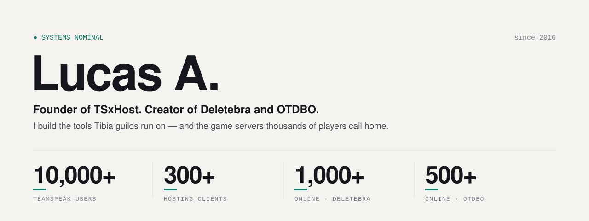
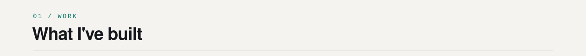
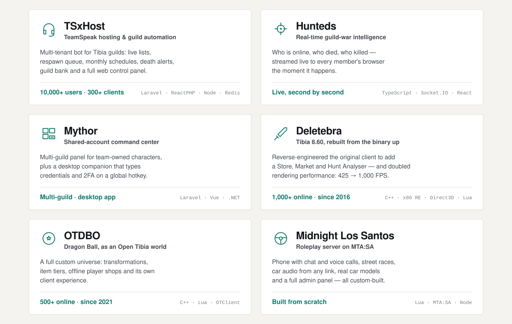
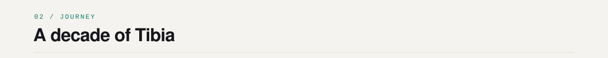
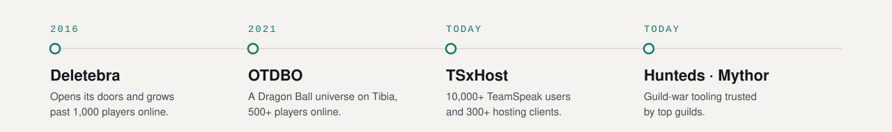
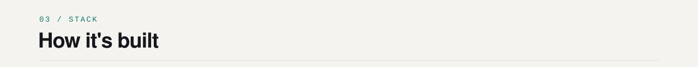
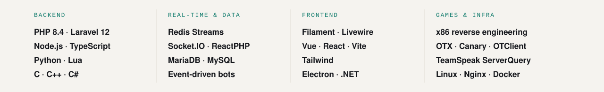

<picture>
  <source media="(prefers-color-scheme: dark)" srcset="assets/hero-dark.svg">
  
</picture>

For ten years I've been building the worlds Tibia players live in and the tools their guilds can't play without.

I created **Deletebra** in 2016 and grew it past **1,000 players online**. In 2021 I opened **[OTDBO](https://otdbo.com.br/)**, a Dragon Ball universe with **500+ online**. Today I run **[TSxHost](https://tsxhost.com/)**, the TeamSpeak platform behind **10,000+ users and 300+ clients**, alongside **[Hunteds](https://hunteds.com/)** and **[Mythor](https://mythor.app/)**, the guild-war and account tooling the top guilds rely on.

I own the whole stack — from x86 patches inside a decade-old game client to real-time services, web panels and the servers they run on.

 

<picture>
  <source media="(prefers-color-scheme: dark)" srcset="assets/sec-work-dark.svg">
  
</picture>

<picture>
  <source media="(prefers-color-scheme: dark)" srcset="assets/projects-dark.svg">
  
</picture>

<b>More of what I've shipped</b>

 

| | |
|---|---|
| **TSxHost Bot** | One bot process per community, dozens of commands and the automation around them: online/hunted/neutral lists rendered live into TeamSpeak, respawn claims and queues, monthly respawn schedules with payments, death and level alerts, guild bank, AFK mover. Works with the official Tibia worlds and with Open Tibia servers such as RubinOT and DeusOT. |
| **Data pipeline** | A scraping service that reads entire game worlds every minute and fans events out over Redis Streams to every tenant — with proxy rotation, health checks and self-healing reconnects. |
| **Deletebra client** | Reverse-engineered rendering, input and UI of the original 8.60 binary: 425 → 1,000 FPS, containers from 36 to 255 slots, a Market ported from 15.x, an in-game Store and a Hunt Analyser. |
| **Lampião** | A modern Open Tibia server on Crystal Server 15.25, with a patched client. |
| **[WappLink](https://github.com/luxxprofissional/wapplink)** | Several WhatsApp accounts in one desktop window, with auto-update. Electron. |

 

<picture>
  <source media="(prefers-color-scheme: dark)" srcset="assets/sec-journey-dark.svg">
  
</picture>

<picture>
  <source media="(prefers-color-scheme: dark)" srcset="assets/timeline-dark.svg">
  
</picture>

 

<picture>
  <source media="(prefers-color-scheme: dark)" srcset="assets/sec-stack-dark.svg">
  
</picture>

<picture>
  <source media="(prefers-color-scheme: dark)" srcset="assets/stack-dark.svg">
  
</picture>

 

<b>Em português</b>

 

Há dez anos eu construo os mundos onde os jogadores de Tibia vivem e as ferramentas sem as quais as guildas deles não jogam.

Criei o **Deletebra** em 2016 e levei a mais de **1.000 jogadores online**. Em 2021 abri o **[OTDBO](https://otdbo.com.br/)**, um universo de Dragon Ball com **500+ online**. Hoje comando a **[TSxHost](https://tsxhost.com/)**, a plataforma de TeamSpeak com **mais de 10.000 usuários e 300+ clientes**, além do **[Hunteds](https://hunteds.com/)** e do **[Mythor](https://mythor.app/)**, as ferramentas de guerra e de contas em que as melhores guildas confiam.

Domino a stack inteira — de patches x86 dentro de um cliente de jogo com mais de uma década a serviços em tempo real, painéis web e os servidores onde tudo roda.

 

**Let's talk** — [tsxhost.com](https://tsxhost.com/) · [luxx.profissional@gmail.com](mailto:luxx.profissional@gmail.com)
