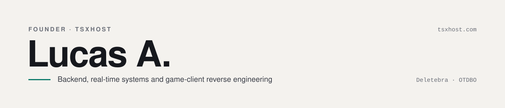

<picture>
  <source media="(prefers-color-scheme: dark)" srcset="assets/header-dark.svg">
  
</picture>

I build and run **[TSxHost](https://tsxhost.com/)** — TeamSpeak hosting and automation for Tibia guilds — and I'm the creator of **Deletebra**, **OTDBO** and other large Open Tibia servers.

Most of my work sits where games meet infrastructure: services that watch a game world in real time and turn it into something a guild can act on, and the low-level work of taking old game clients further than they were ever meant to go.

 

## Products

| | |
|---|---|
| **TSxHost** | TeamSpeak hosting with a multi-tenant bot for Tibia guilds. Online, hunted and neutral lists; respawn queue and monthly respawn schedules; death, level and login alerts; guild bank; a full web control panel. Works with the official Tibia worlds and with Open Tibia servers such as RubinOT and DeusOT.  PHP 8.4 · Laravel 12 · Filament · Livewire · ReactPHP · Node.js · TypeScript · Redis Streams · MariaDB |
| **Hunteds** | Real-time tracking for guild wars: who is online, who died and who killed, streamed live to the browser.  Node.js · TypeScript · Socket.IO · React · Vite · MySQL · Redis |
| **Mythor** | Multi-guild panel for managing shared Tibia accounts, with a desktop companion that types credentials and TOTP codes into the game client on a global hotkey.  Laravel · Vue · .NET |

## Open Tibia

| | |
|---|---|
| **Deletebra** | Creator. A Tibia 8.60 server with its own client. Reverse-engineered the original binary client to add a Store, a Hunt Analyser and a Market, raise container limits, and double rendering performance — from 425 to 1,000 FPS.  C · C++ · x86 reverse engineering · DirectDraw / Direct3D hooking · Lua |
| **OTDBO** | Creator. A Dragon Ball–themed Open Tibia server with custom systems such as offline player shops and item tiers.  C++ · Lua · OTClient |

 

## Toolbox

| | |
|---|---|
| **Backend** | PHP · Laravel · Node.js · TypeScript · Python · Lua |
| **Real-time & data** | Redis Streams · Socket.IO · ReactPHP · MariaDB / MySQL |
| **Frontend** | Filament · Livewire · Vue · React · Tailwind |
| **Games** | Open Tibia (OTX · Canary · Crystal Server) · OTClient · TeamSpeak / TeaSpeak ServerQuery · binary patching |
| **Infrastructure** | Linux · Nginx · Supervisor · systemd · Docker · Cloudflare |

 

<b>Em português</b>

 

Desenvolvo e opero a **[TSxHost](https://tsxhost.com/)** — hospedagem de TeamSpeak e automação para guildas de Tibia — e sou o criador do **Deletebra**, do **OTDBO** e de outros servidores grandes de Open Tibia.

Trabalho principalmente com backend, sistemas em tempo real e engenharia reversa de clientes de jogo: do bot que acompanha um mundo inteiro e transforma isso em listas, alertas e planilhas para a guilda, até patches no cliente 8.60 que levaram o desempenho de 425 para 1.000 FPS.

 

**Contact** — [tsxhost.com](https://tsxhost.com/) · [luxx.profissional@gmail.com](mailto:luxx.profissional@gmail.com)
